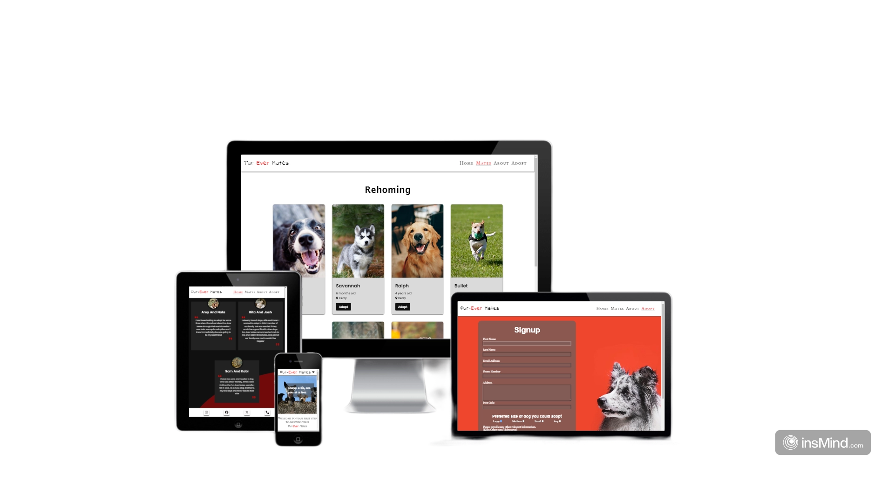
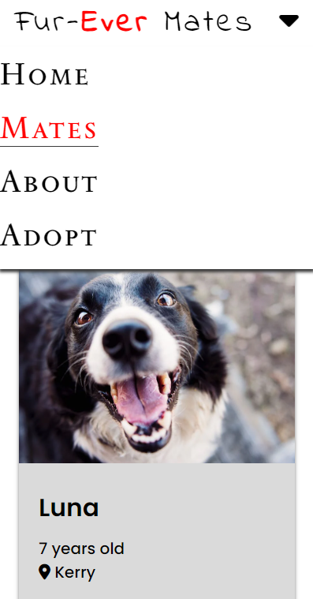
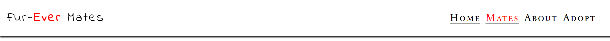
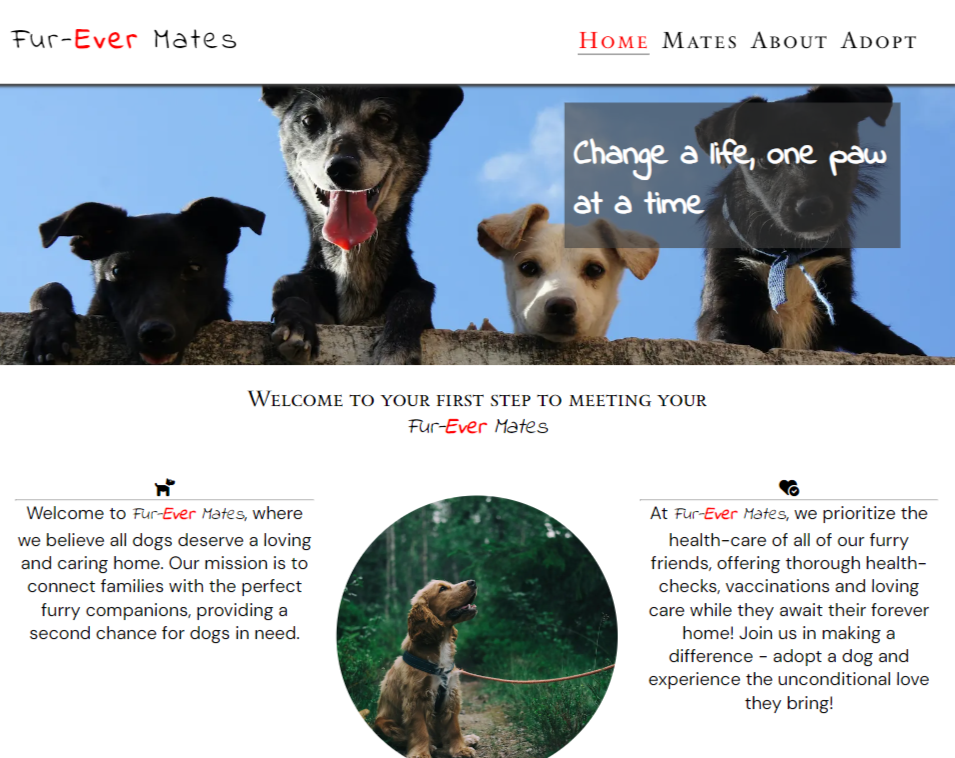
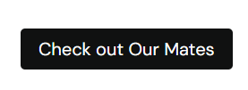
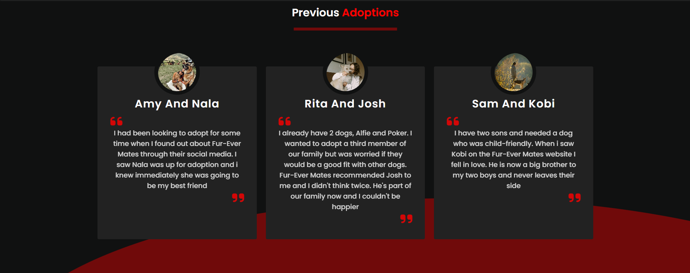
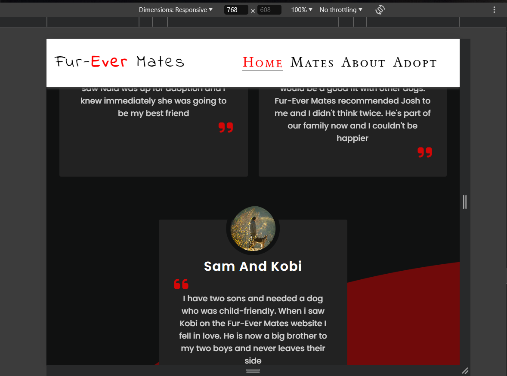
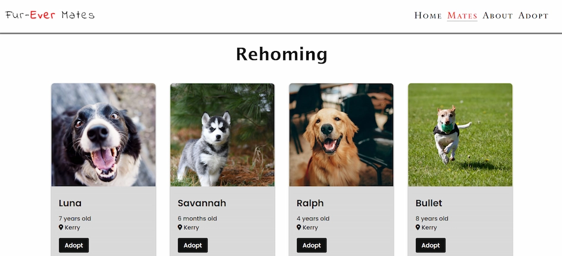
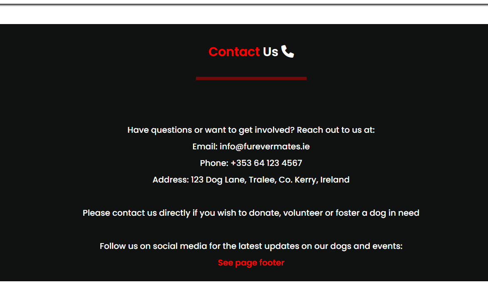
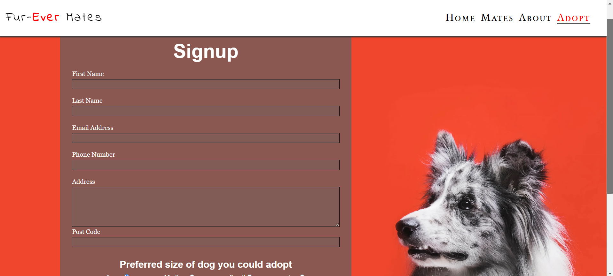

# Fur-Ever Mates

*Fur-Ever Mates* is a dog adoption agency based in Kerry, Ireland. The goal of this site is to pair dogs currently without families to suitable and caring homes. 

This site contains a simple but elegant home page with reviews from previous adopters, a rehoming page where you can see dogs that are currently for adoption, an about page with a contact section and a sign up form to be considered for screening.

**Please note:** Fur-Ever Mates is currently only an idea. You cannot as of yet use this site to adopt or foster any dogs and all dogs showcased on this site are not available for adoption.

### [Visit Fur-ever-Mates](https://simonmoynihan33.github.io/fur-ever-mates-adoption/)

## Table of Contents

- [User Experience](#user-experience)
- [Goals](#goals)
- [Features](#features)
- [Design](#design)
- [Testing](#testing)
- [Bugs](#bugs)
- [Deployment](#deployment)
- [Credits](#credits)
- [Conclusion](#conclusion)

## User Experience

### First Time Users

New users who come to this site will already be searching for options when it comes to adopting a dog. The goal of this site is not based on impulsive decisions, rather well planned aims to adopt. Adopting a dog is a major commitment, therefore you cannot adopt by pressing a button but must apply and pass a screening process. The site is friendly to new users but does not cater to spur of the moment decisions.

#### Goals for first time users

As somebody who is using this site for the first time I want to:
- Understand what the site is
- Know how to apply
- See what dogs are currently available
- Be aware of how i can help in other ways if I cannot adopt
- Know how to get in contact with the agency

### Repeat Users

Fur-ever Mates thrives off of users following up. For this reason the apply page was implemented to keep in touch with aspiring owners, gathering vital information such as email, phone and information relevant when it comes to dog ownership (number of kids/other pets).

## Goals

Fur-Ever Mates aims to create a compassionate and efficient platform dedicated to uniting loving families with their ideal canine companions. Our primary goals are to ensure the well-being and happiness of all dogs in our care, provide thorough and transparent adoption processes, and educate potential pet owners on responsible pet ownership. We are committed to working closely with local shelters, rescue organizations, and volunteers to offer a wide variety of dogs, from puppies to seniors, each with their unique stories and needs. By fostering a supportive community of dog lovers, Fur-Ever Mates strives to reduce the number of homeless dogs and enhance the human-animal bond through thoughtful matchmaking and ongoing support for adopters.

## Features

### Logo 

- *Fur-Ever Mates* logo is simple but distinct. The aim of this is to make a memorable and user friendly experience. The color red is used in the logo and throughout the site to have a unique identifier and page theme. The inspiration from this came from [Dogs Trust](https://www.dogstrust.ie/), where they use a yellow theme that sets it apart and keeps it memorable.

### Nav Bar

The Nav Bar of the page consists of a white background, the logo and links to each individual page.

- *Below 768px:* On screens below 768px, the navbar condenses and the links are hidden behind a down arrow dropdown toggle. When clicked, the navbar expands vertically to show each visitable page, simultaneously showing which page you are on by highlighting your current location in red. 

- *768 and above:* On screens 768px and above, the navbar has enough room to house all page links horizontally, while not smothering the logo. The red highlight of the current location can still be seen on screens of this size. This was done via *media query*.

- *Laptops and larger:* On screen sizes 992px and above it can be assumed the user is using a cursor to navigate the page. Here, we have implemented not only the red highlighting of the current location but a border underline when an element in the nav is hovered over. This conveys that the link is clickable and adds a level of professionalism to the site. 

### Hero Image 

- The hero image was downloaded from [Pexels](https://www.pexels.com/). The image is bright and shows four dogs looking over a wall. This is to produce a positive emotional reaction from the user.

- Cover text is also present, with the slogan "Change a life, one paw at a time". There is a transparent background behind this to make it more accessible color-wise.

### Introduction Section

- Next there is the introduction section to the website. This is a short but descriptive overview of what our goals are as an organisation, and what we do for dogs in our care, also including a circular image of a dog being walked. 

- "Check out our mates" button is displayed below this which will direct users to the mates page.

### Testimonials

- Below the introduction section is a testimonials section with user reviews. This section was created with the aid of a youtube tutorial documented in the [credits](#credits) part of the readme. 

In this section is a black background with three dark colored cards, a small image, red blockquotes and some text. There is also a red transparent circle in the background to add some color and styling. This section, like all others, is fully responsive. On mobiles they are displayed on top of one another, whereas on tablet there is 2 in a row and one underneath and on laptops all three are in a clean and even row. 

### Footer

- The footer for this website took inspiration from the Love Running Walkthrough project, with some custom styling to add borders and shadows to each social media link. The last link (the phone icon) will bring users to our contact section on the about page. 

### Mates

**Rehoming Section**

- This is the main page users will visit if they are planning on using our site. We have gone with a simple but clean design so as not to distract users. There are currently six cards, all with the name, location and a photo of available pets. 

- Each card has a button that when clicked, directs the user to our signup page to apply for adoption.

### About 

- Our third page, the about section, gives a more detailed description of what we do and how we care for our dogs. Beneath this, is a section outlining how you can help.

### Contact

**Informative information on contacting us**
 - Users get in-depth information on how to contact us, and how to go about helping in whatever way they can. This section can also be accessed through the footer.

 

 ### Adopt 

 **Apply for screening**

 - A sleek form on a red background with a border collie of to the right, this page allows users to apply to adopt a dog currently in our care.

## Design

The design of Fur-Ever Mates is a friendly and warm one, encouraging positive emotional reaction and hope. The page incorporates the main colors of white, black and splashes of red to promote association and unique identity. 

It offers a clean and descriptive landing page, instantly telling users the purpose of the site, with reviews to highlight the satisfaction from previous adopters. 

The Mates page is an effective design, featuring cards displaying an image and information about the dogs. The location line uses a [Font Awesome](https://fontawesome.com/?utm_source=v4_homepage&utm_medium=display&utm_campaign=fa5_released&utm_content=banner) icon to quickly identify where this dog is in relation to the user. The information on this page is limited but important. In the future we hope to add more information about our dogs such as breed, gender, temperament and current health-status. 

"About" is a simple but clean and not overwhelming design without images or background colors. This page is a more detailed and informative page and is best left with the text being the main focus. Icons are used to add some style but keep the minimalistic approach. Beneath the about section is the contact section, outlining how to get in touch with us. The style for this was keeping in line with the testimonials section at the bottom of the landing page.

Finally, the signup page is where we wish to use vibrant and bright colors to convey a sense of happiness and hope. The red background image keeps in line with the page's theme, with a signup form including a dark background to add contrast and make the text easier to read. 

## Testing 

In this section, you need to convince the assessor that you have conducted enough testing to legitimately believe that the site works well. Essentially, in this part you will want to go over all of your project’s features and ensure that they all work as intended, with the project providing an easy and straightforward way for the users to achieve their goals.

In addition, you should mention in this section how your project looks and works on different browsers and screen sizes.

You should also mention in this section any interesting bugs or problems you discovered during your testing, even if you haven't addressed them yet.

If this section grows too long, you may want to split it off into a separate file and link to it from here.

### Validator Testing 

- HTML
  - No errors were returned when passing through the official [W3C validator](https://validator.w3.org/nu/?doc=https%3A%2F%2Fsimonmoynihan33.github.io%2Ffur-ever-mates-adoption%2Findex.html)
- CSS
  - No errors were found when passing through the official [(Jigsaw) validator](https://jigsaw.w3.org/css-validator/validator?uri=https%3A%2F%2Fsimonmoynihan33.github.io%2Ffur-ever-mates-adoption%2Findex.html&profile=css3svg&usermedium=all&warning=1&vextwarning=&lang=en)

### Unfixed Bugs

You will need to mention unfixed bugs and why they were not fixed. This section should include shortcomings of the frameworks or technologies used. Although time can be a big variable to consider, paucity of time and difficulty understanding implementation is not a valid reason to leave bugs unfixed. 

### Fixed Bugs

## Deployment

- The site was deployed to GitHub pages. The steps to deploy are as follows: 
  - In the GitHub repository, navigate to the Settings tab 
  - From the source section drop-down menu, select the Master Branch
  - Once the master branch has been selected, the page will be automatically refreshed with a detailed ribbon display to indicate the successful deployment. 

The live link can be found here - https://simonmoynihan33.github.io/my-pp1-project/

## Credits 

### General Credits

- Nav skeleton was taken from Love Running project.
- Nav toggle and dropdown was created while watching Love Running walkthrough
- [FocoClipping](https://www.fococlipping.com/) was used for clipping photos such as am i responsive.
- [Squoosh](https://squoosh.app/) was used to compress images and format them to webp.
- [Pexels](https://www.pexels.com/) was where free images were collected from. 

### Images

**Landing page**
- [Hero Image](https://www.pexels.com/photo/black-and-white-short-coated-dogs-3628100/). By "Edgar Daniel Hernández Cervantes".
- [Circular image on home screen](https://www.pexels.com/photo/english-cocker-spaniel-puppy-sitting-on-ground-beside-grass-1254140/). By "Johann".
- [First Testimonial](https://www.pexels.com/photo/woman-sitting-with-dogs-on-grass-20584832/) image. By "Ana María Franco Arias".
- [Second Testimonial](https://images.pexels.com/photos/8498519/pexels-photo-8498519.jpeg?auto=compress&cs=tinysrgb&w=1260&h=750&dpr=1) image URL . By "Yaroslav Shuraev".
- [Third Testimonial](https://images.pexels.com/photos/10369105/pexels-photo-10369105.jpeg?auto=compress&cs=tinysrgb&w=1260&h=750&dpr=1) image. By "Nine Lives Cats Etc".

**Mates**
- [Rehome image 1](https://images.pexels.com/photos/551628/pexels-photo-551628.jpeg?auto=compress&cs=tinysrgb&w=1260&h=750&dpr=1). By Kat Smith.
- [Rehome image 2](https://www.pexels.com/photo/black-and-white-siberian-husky-puppy-on-brown-grass-field-3726314/). By Julissa Helmuth.
- [Rehome image 3](https://www.pexels.com/photo/short-coated-tan-dog-2253275/). By Helena Lopez.
- [Rehome image 4](https://www.pexels.com/photo/dog-running-on-grass-422220/). By Matthias Zomer.
- [Rehome image 5](https://www.pexels.com/photo/adult-german-shepherd-lying-on-ground-333083/). By summer stock.
- [Rehome image 6](https://www.pexels.com/photo/pawn-pug-sitting-on-beige-floor-1591939/). By Steshka Willems. 

**Signup**
- Signup background picture (Image by <a href="https://www.freepik.com/free-photo/studio-shot-cute-border-collie-dog_4079496.htm#query=dog%20red%20background&position=29&from_view=keyword&track=ais_user&uuid=1aa94c23-d832-4cce-b235-77912b7005eb">Freepik</a>)

### Tutorials
- Testimonials section was created with help of youtube video: (https://www.youtube.com/watch?v=6R_feb4rMnc). By "WebKitCoding".
- Rehome section created with help of tutorial: (https://www.youtube.com/watch?v=9FNNkzPBFcE). By "Learn Web".

### Icons
- [Font Awesome](https://fontawesome.com/?utm_source=v4_homepage&utm_medium=display&utm_campaign=fa5_released&utm_content=banner) used for icons throughout page. 

### Fonts
- [Google Fonts](https://fonts.google.com/) used to capture fonts.

### Content 
- [ChatGPT](https://openai.com/index/chatgpt/) was used for some of the content such as introduction section and about page. 

## Conclusion

Below you will find a couple of extra tips that may be helpful when completing your project. Remember that each of these projects will become part of your final portfolio so it’s important to allow enough time to showcase your best work! 

- One of the most basic elements of keeping a healthy commit history is with the commit message. When getting started with your project, read through [this article](https://chris.beams.io/posts/git-commit/) by Chris Beams on How to Write  a Git Commit Message 
  - Make sure to keep the messages in the imperative mood 

- When naming the files in your project directory, make sure to consider meaningful naming of files, point to specific names and sections of content.
  - For example, instead of naming an image used ‘image1.png’ consider naming it ‘landing_page_img.png’. This will ensure that there are clear file paths kept. 

- Do some extra research on good and bad coding practices, there are a handful of useful articles to read, consider reviewing the following list when getting started:
  - [Writing Your Best Code](https://learn.shayhowe.com/html-css/writing-your-best-code/)
  - [HTML & CSS Coding Best Practices](https://medium.com/@inceptiondj.info/html-css-coding-best-practice-fadb9870a00f)
  - [Google HTML/CSS Style Guide](https://google.github.io/styleguide/htmlcssguide.html#General)

Getting started with your Portfolio Projects can be daunting, planning your project can make it a lot easier to tackle, take small steps to reach the final outcome and enjoy the process! 

[def]: assetts/images/readme-img/amiresponsive.png