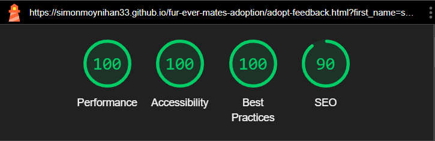
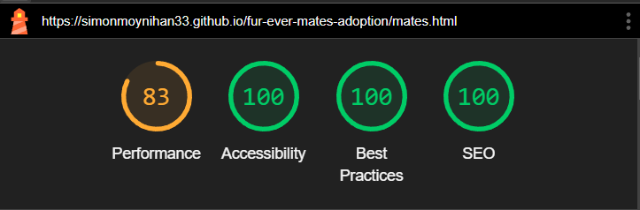

# Fur-Ever Mates

*Fur-Ever Mates* is a dog adoption agency based in Kerry, Ireland. The goal of this site is to pair dogs currently without families with suitable and caring homes. 

This site contains a simple but elegant home page with reviews from previous adopters, a rehoming page where you can see dogs that are currently up for adoption, an about page with a contact section, and a sign-up form to be considered for screening.

## Why Fur-Ever Mates?

I chose this idea because I believe there are too many dogs seeking a home. I have one rescue dog whom we adopted two years ago, and it is always the route I would take before buying dogs from breeders. It is a luxury to purchase a specific dog that you want, but decisions such as this can sometimes result in abandonment if paired with poor planning and unrealistic expectations. Many people do not know the time and care it takes to own a dog and, therefore, cannot keep up with the responsibilities. 

"Over 3,000 dogs are living in shelters and pounds across the country as “hundreds” more are on waiting lists, a new survey shows." ~ [Irish Independent, 2023](https://www.independent.ie/irish-news/over-3000-dogs-in-shelters-across-ireland-revealing-dire-situation-after-pandemic/a1809558249.html)

This number breaks my heart as I know it does for many. Adopting dogs already in search of homes is the only way to save many of these loyal and loving animals. 

Dogs are among the most loyal creatures in the world, and they all deserve to be treated as such. 

**Please note:** Fur-Ever Mates is currently only an idea. You cannot as of yet use this site to adopt or foster any dogs and all dogs showcased on this site are currently not available for adoption.

### [Visit Fur-ever-Mates](https://simonmoynihan33.github.io/fur-ever-mates-adoption/)

## Table of Contents

- [Creation Structure](#creation-structure)
- [User Experience](#user-experience)
- [Goals](#goals)
- [Features](#features)
- [Design](#design)
- [Future Deployment](#future-deployment)
- [Testing](#testing)
- [Bugs](#bugs)
- [Deployment](#deployment)
- [Credits](#credits)

## Creation Structure

Fur-Ever Mates was created using the mobile-first method. This ensures the best possible experience for mobile users who make up the majority of the traffic on sites. ["As of 2024, 60.67% of website traffic comes from Mobile Devices"](https://whatsthebigdata.com/mobile-internet-traffic/) ~ [whatsthebigdata.com](https://whatsthebigdata.com/).

I then worked my way back via media queries (540px and up, 768px and up, 992px and up, 2400px and up). This ensures the best experience for all users.

### Wireframes
- **Landing Page on desktop**

- **Landing page with introduction on mobile**

Initially, I did not plan on adding a testimonials section to the project. I decided to add this when i started to feel much more comfortable with coding, and felt i had sufficient time to do it.

- **About Desktop**

- **About Mobile**

In the beginning stages of my project, my rehoming section and the about section were going to be on the same page. After some thinking and replanning i decided to seperate them to give them both the attention they deserve as they are different pages with different goals.

**Signup**

## User Experience

### First Time Users

New users who come to this site will already be searching for options for adopting a dog. The goal of this site is not based on impulsive decisions, rather well planned aims to adopt. Adopting a dog is a major commitment, therefore you cannot adopt by pressing a button but must apply and pass a screening process. The site is friendly to new users but does not cater to spur of the moment decisions.

#### Goals for first time users

As someone who is using this site for the first time, I want to:
- Understand what the site is
- Know how to apply
- See what dogs are currently available
- Be aware of how I can help in other ways if I cannot adopt
- Know how to get in contact with the agency

### Repeat Users

Fur-ever Mates thrives on users following up. For this reason the apply page was implemented to keep in touch with aspiring owners, gathering vital information such as email, phone and information relevant when it comes to dog ownership (number of kids/other pets).

## Goals

Fur-Ever Mates aims to create a compassionate and efficient platform dedicated to uniting loving families with their ideal canine companions. Our primary goals are to ensure the well-being and happiness of all dogs in our care, provide thorough and transparent adoption processes, and educate potential pet owners on responsible pet ownership. We are committed to working closely with local shelters, rescue organizations, and volunteers to offer a wide variety of dogs, from puppies to seniors, each with their unique stories and needs. By fostering a supportive community of dog lovers, Fur-Ever Mates strives to reduce the number of homeless dogs and enhance the human-animal bond through thoughtful matchmaking and ongoing support for adopters.

## Features

### Logo 

- *Fur-Ever Mates* logo is simple but distinct. The aim of this is to make a memorable and user friendly experience. The color red is used in the logo and throughout the site to have a unique identifier and page theme. The inspiration from this came from [Dogs Trust](https://www.dogstrust.ie/), where they use a yellow theme that sets it apart and keeps it memorable.

### Nav Bar

The Nav Bar of the page consists of a white background, the logo, and links to each individual page.

- *Below 768px:* On screens below 768px, the navbar condenses and the links are hidden behind a down arrow dropdown toggle. When clicked, the navbar expands vertically to show each visitable page, simultaneously showing which page you are on by highlighting your current location in red. 

- *768 and above:* On screens 768px and above, the navbar has enough room to house all page links horizontally, while not smothering the logo. The red highlight of the current location can still be seen on screens of this size. This was done via *media query*.

- *Laptops and larger:* On screen sizes 992px and above it can be assumed the user is using a cursor to navigate the page. Here, we have implemented not only the red highlighting of the current location but a border underline when an element in the nav is hovered over. This conveys that the link is clickable and adds a level of professionalism to the site. 

### Hero Image 

- The Hero image was downloaded from [Pexels](https://www.pexels.com/). The image is bright and shows four dogs looking over a wall. This is to produce a positive emotional reaction from the user.

- There is a hero image set for mobile and also for devices 768px and above. 

- Cover text is also present, with the slogan "Change a life, one paw at a time". There is a transparent background behind this to make it more accessible color-wise.

### Introduction Section

- Next there is the introduction section to the website. This is a short but descriptive overview of what our goals are as an organization and what we do for dogs in our care, also including a circular image of a dog being walked. 

- "Check out our mates" button is displayed below this which will direct users to the Mates page.

### Testimonials

- Below the introduction section is a Testimonials section with user reviews. This section was created with the aid of a youtube tutorial documented in the [credits](#credits) part of the readme. 

In this section is a black background with three dark-colored cards, a small image, red blockquotes, and some text. There is also a red transparent circle in the background to add some color and styling. This section, like all others, is fully responsive. On mobiles they are displayed on top of one another, whereas on tablet there is 2 in a row and one underneath and on laptops all three are in a clean and even row. 

### Footer

- The footer for this website took inspiration from the Love Running Walkthrough project, with some custom styling to add borders and shadows to each social media link. The last link (the phone icon) will bring users to our contact section on the about page. 

### Mates

**Rehoming Section**

- This is the main page users will visit if they are planning on using our site. We have gone with a simple but clean design so as not to distract users. There are currently six cards, all with the name, location and a photo of available pets. 

- Each card has a button that when clicked, directs the user to our signup page to apply for adoption.

### About 

- Our third page, the about section, gives a more detailed description of what we do and how we care for our dogs. Beneath this, is a section outlining how you can help.

### Contact

**Informative information on contacting us**
 - Users get in-depth information on how to contact us, and how to go about helping in whatever way they can. This section can also be accessed through the footer.

 

 ### Adopt 

 **Apply for screening**

 - A sleek form on a red background with a border collie to the right, this page allows users to apply to adopt a dog currently in our care.

 

 ### Submission page

 - Custom page showing you have submitted your form with a button to bring you back to the home page.

 

 ### 404 page

 - Custom 404 page with a home button to tell users there is no pagew ithin our site matching their search results and a button to bring them back to the home page.

 

## Design

The design of Fur-Ever Mates is friendly and warm, encouraging positive emotional reaction and hope. The page incorporates the main colors of white, black and splashes of red to promote association and unique identity. 

It offers a clean and descriptive landing page, instantly telling users the purpose of the site, with reviews to highlight the satisfaction from previous adopters. 

The Mates page is an effective design, featuring cards displaying an image and information about the dogs. The location line uses a [Font Awesome](https://fontawesome.com/?utm_source=v4_homepage&utm_medium=display&utm_campaign=fa5_released&utm_content=banner) icon to quickly identify where this dog is in relation to the user. The information on this page is limited but important. In the future we hope to add more information about our dogs such as breed, gender, temperament and current health-status. 

"About" is a simple but clean and not overwhelming design without images or background colors. This page is a more detailed and informative page and is best left with the text being the main focus. Icons are used to add some style but keep the minimalistic approach. Beneath the about section is the contact section, outlining how to get in touch with us. The style for this was keeping in line with the testimonials section at the bottom of the landing page.

Finally, the signup page is where we wish to use vibrant and bright colors to convey a sense of happiness and hope. The red background image keeps in line with the page's theme, with a signup form including a dark background to add contrast and make the text easier to read. 

## Future Deployment

I believe this website is already fit for usage, but improvements can always be made. In the future some things I would like to implement are: 
- Better usability for screen sizes above 2000px.
- A location and map if this was a real organisation.
- More styles to rehoming section (mates page). The design for this page is functional and attractive, but with more dogs added and more time to do so, this page would have it's own unique style, with more information about each dog and a dropdown for each to display this. Also, whichever adopt button is pressed would be sent to the server along with the form. 
- More pages, educating pet owners on responsible pet ownership, advice and FAQ's
- An AI bot, to answer questions put forward by users and if necessary, direct users to a member of the support team

## Testing 

### Manual Testing

In addition to automated testing, extensive manual testing was conducted to ensure that the site functions correctly across different browsers and devices. This included checking:

- Responsiveness on various screen sizes (desktop, tablet, and mobile).
- Functionality of navigation links and buttons.
- Form submission and validation.
- Image loading and aspect ratios.
- Each media link opens in new tab.

Also, the final website was sent around to family and friends, none of which came back with any faults. This included 10 or more individuals on varying screen sizes. 

### Lighthouse scores
- **Desktop**

- **Mobile**

- There is room for improvement on mobile, mainly due to the LCP. This can  be worked on in future deployments.

### Validator Testing 

- HTML
  - **Landing page** No errors were returned when passing through the official [W3C validator](https://validator.w3.org/nu/?doc=https%3A%2F%2Fsimonmoynihan33.github.io%2Ffur-ever-mates-adoption%2F)
  - **Mates page** No errors were returned when passing through the official [W3C validator](https://validator.w3.org/nu/?doc=https%3A%2F%2Fsimonmoynihan33.github.io%2Ffur-ever-mates-adoption%2Fmates.html)
  - **About page** No errors were returned when passing through the official [W3C validator](https://validator.w3.org/nu/?doc=https%3A%2F%2Fsimonmoynihan33.github.io%2Ffur-ever-mates-adoption%2Fabout.html)
  - **Adopt page** No errors were returned when passing through the official [W3C validator](https://validator.w3.org/nu/?doc=https%3A%2F%2Fsimonmoynihan33.github.io%2Ffur-ever-mates-adoption%2Fadopt.html)
  - **Adopt feedback page** No errors were returned when passing through the official W3C validator
  
  
- CSS
  - No errors were found when passing through the official Jigsaw validator via direct input
  
  

- WAVE
  - Each page was put through [WAVE](https://wave.webaim.org/) evaluation tool and any errors found were fixed.

## Bugs

### Unfixed Bugs

This website looses some usability at width: 2000px; and above. This can be fixed with media queries in future deployments.

### Fixed Bugs

#### Landing Page

**Hero image**
The Hero image of the landing page was not tall enough on larger screens and cut out majority of the image.

*To fix this:*
- I added a media query for 2400px and up so the height of the image fit much better

**Introduction Image**

The image was too large for the perameters I had set. Cutting and resizing the image solved this issue.

**Testimonials**

On screens larger than 1400px, the testimonials section became too large for the content beneath it. This was due to the *100vh* height I set to this section. Removing this solved the issue.

Testimonial images were at their full size when only needing to be 100x100. This issue was solved by resizing images.  

#### Mates page

On the mates page, my images were not cropped or condensed to the correct size. This was causing bad performance on mobile screens when brought to the lighthouse.

When I condensed the image, this caused the cards to go off center and leave a large column to the right of the images on larger screens and off centered images on smaller. 

**To fix this**
- First, I condensed each image to be the same height and width, this solved the issue of my images being too large and negatively effecting my performance of this page.
- I then removed *translateX()* code I previously used, which was moving images off center.
- Finally, I added media queries to multiple screen sizes (768px and up, 992px and up, and 2400px and up). I added the media query of 2400px and up to solve the issues with large desktop screens.

## Deployment

- The site was deployed to GitHub pages. The steps to deploy are as follows: 
  - In the GitHub repository, navigate to the Settings tab 
  - From here, navigate to the pages section
  - Change branch to main if not already selected
  - Click save
  - Go back to Code section on the top left
  - Scroll to deployments

The live link can be found here - https://simonmoynihan33.github.io/fur-ever-mates-adoption/

## Credits 

### General Credits

- Nav skeleton was taken from Love Running project.
- Nav toggle and dropdown was created while watching Love Running walkthrough
- [FocoClipping](https://www.fococlipping.com/) was used for clipping photos such as am i responsive.
- [Squoosh](https://squoosh.app/) was used to compress images and format them to webp.
- [Pexels](https://www.pexels.com/) was where free images were collected from. 
- My mentor, David Bowers was instrumental in guiding me through this project.

### Images

**Landing page**
- [Hero Image](https://www.pexels.com/photo/black-and-white-short-coated-dogs-3628100/). By "Edgar Daniel Hernández Cervantes".
- [Circular image on home screen](https://www.pexels.com/photo/english-cocker-spaniel-puppy-sitting-on-ground-beside-grass-1254140/). By "Johann".
- [First Testimonial](https://www.pexels.com/photo/woman-sitting-with-dogs-on-grass-20584832/) image. By "Ana María Franco Arias".
- [Second Testimonial](https://images.pexels.com/photos/8498519/pexels-photo-8498519.jpeg?auto=compress&cs=tinysrgb&w=1260&h=750&dpr=1) image URL . By "Yaroslav Shuraev".
- [Third Testimonial](https://images.pexels.com/photos/10369105/pexels-photo-10369105.jpeg?auto=compress&cs=tinysrgb&w=1260&h=750&dpr=1) image. By "Nine Lives Cats Etc".

**Mates**
- [Rehome image 1](https://images.pexels.com/photos/551628/pexels-photo-551628.jpeg?auto=compress&cs=tinysrgb&w=1260&h=750&dpr=1). By Kat Smith.
- [Rehome image 2](https://www.pexels.com/photo/black-and-white-siberian-husky-puppy-on-brown-grass-field-3726314/). By Julissa Helmuth.
- [Rehome image 3](https://www.pexels.com/photo/short-coated-tan-dog-2253275/). By Helena Lopez.
- [Rehome image 4](https://www.pexels.com/photo/dog-running-on-grass-422220/). By Matthias Zomer.
- [Rehome image 5](https://www.pexels.com/photo/adult-german-shepherd-lying-on-ground-333083/). By summer stock.
- [Rehome image 6](https://www.pexels.com/photo/pawn-pug-sitting-on-beige-floor-1591939/). By Steshka Willems. 

**Signup**
- Signup background picture (Image by <a href="https://www.freepik.com/free-photo/studio-shot-cute-border-collie-dog_4079496.htm#query=dog%20red%20background&position=29&from_view=keyword&track=ais_user&uuid=1aa94c23-d832-4cce-b235-77912b7005eb">Freepik</a>)

### Tutorials
- Testimonials section was created with help of youtube video: (https://www.youtube.com/watch?v=6R_feb4rMnc). By "WebKitCoding".
- Rehome section created with help of tutorial: (https://www.youtube.com/watch?v=9FNNkzPBFcE). By "Learn Web".

### Icons
- [Font Awesome](https://fontawesome.com/?utm_source=v4_homepage&utm_medium=display&utm_campaign=fa5_released&utm_content=banner) used for icons throughout page. 

### Fonts
- [Google Fonts](https://fonts.google.com/) used to capture fonts.

### Content 
- [ChatGPT](https://openai.com/index/chatgpt/) was used for some of the content such as introduction section and about page. 
